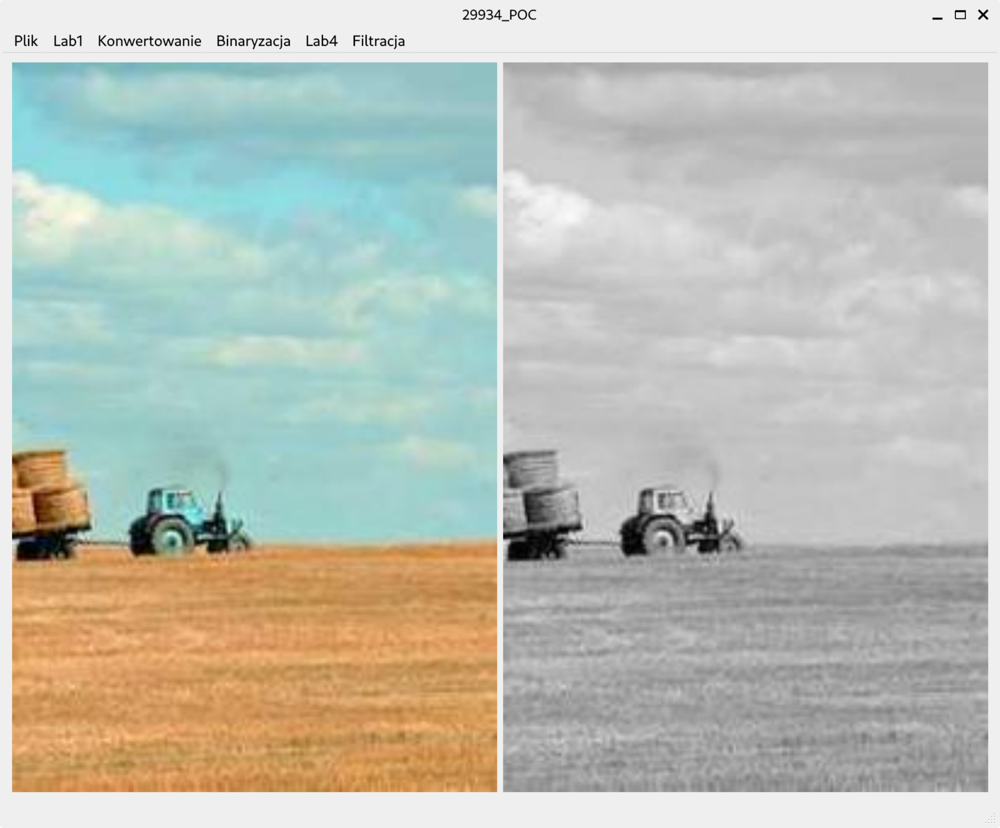
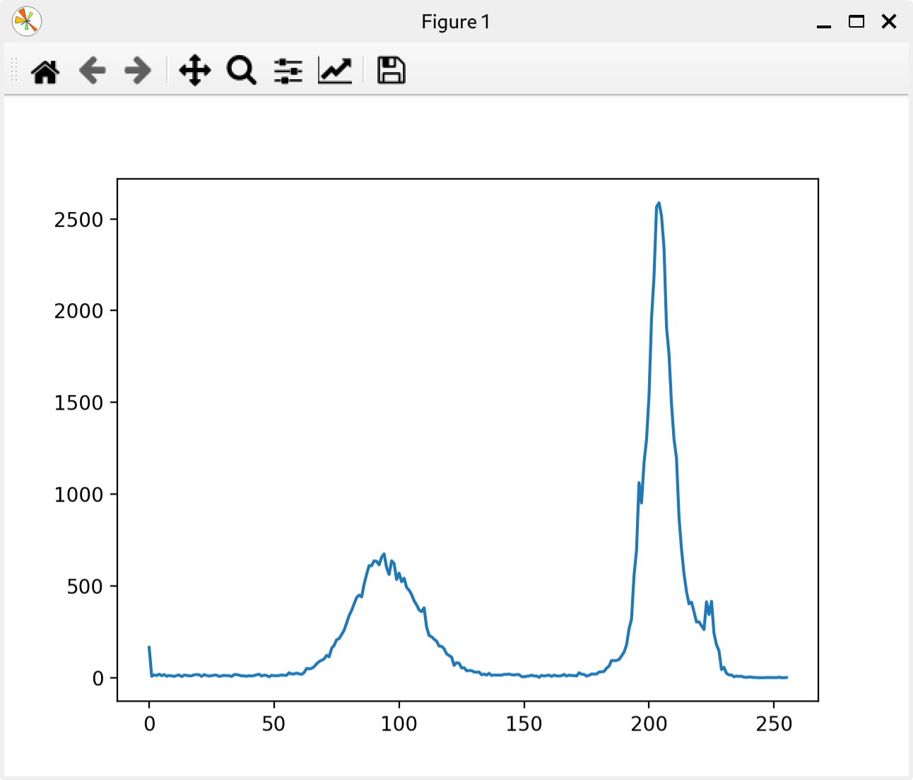
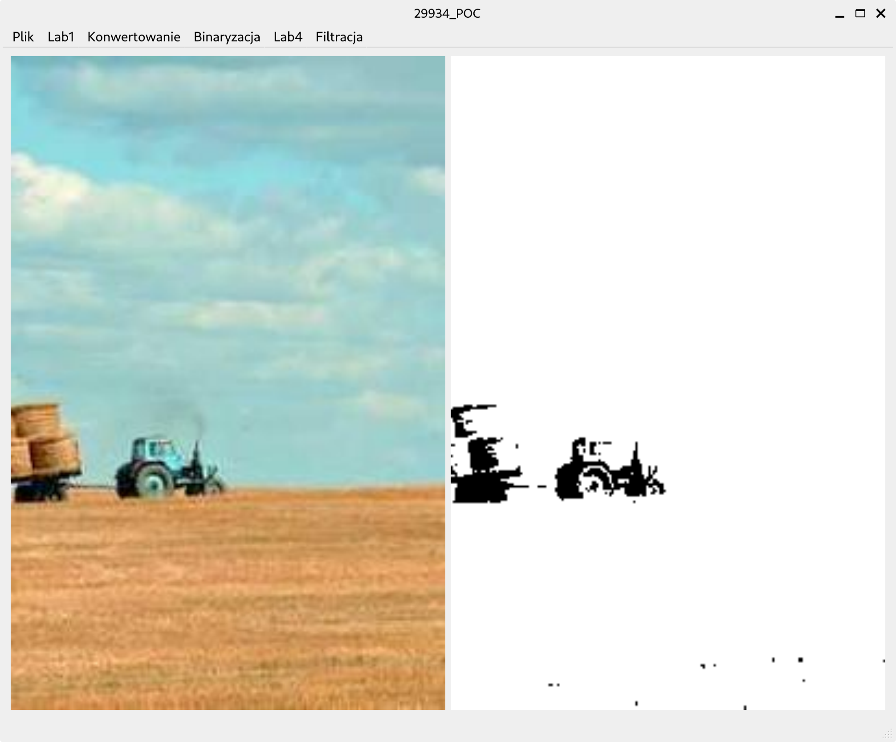
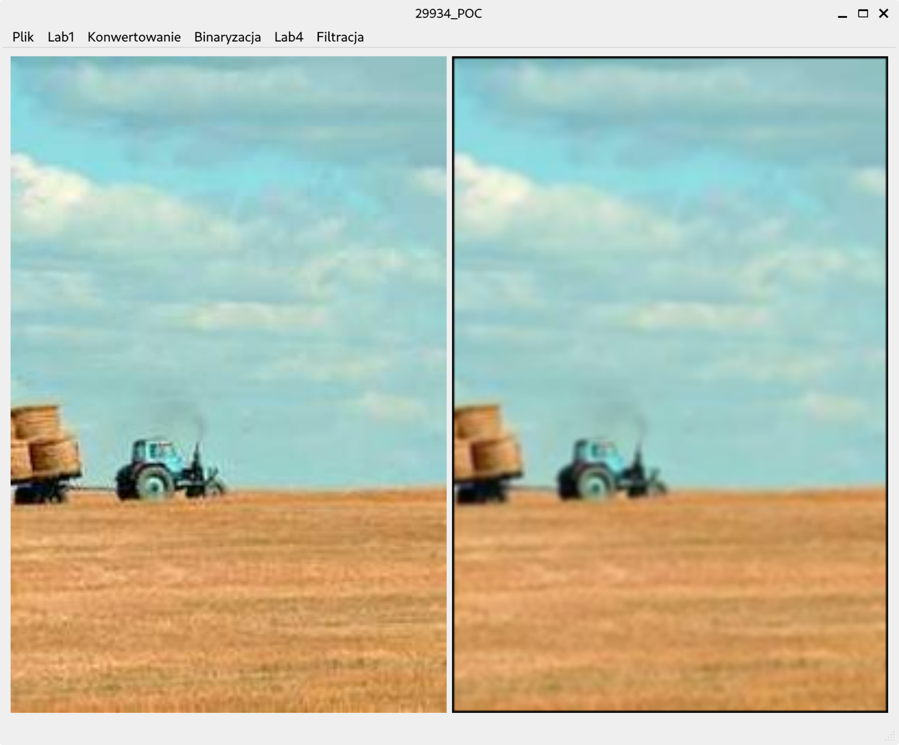
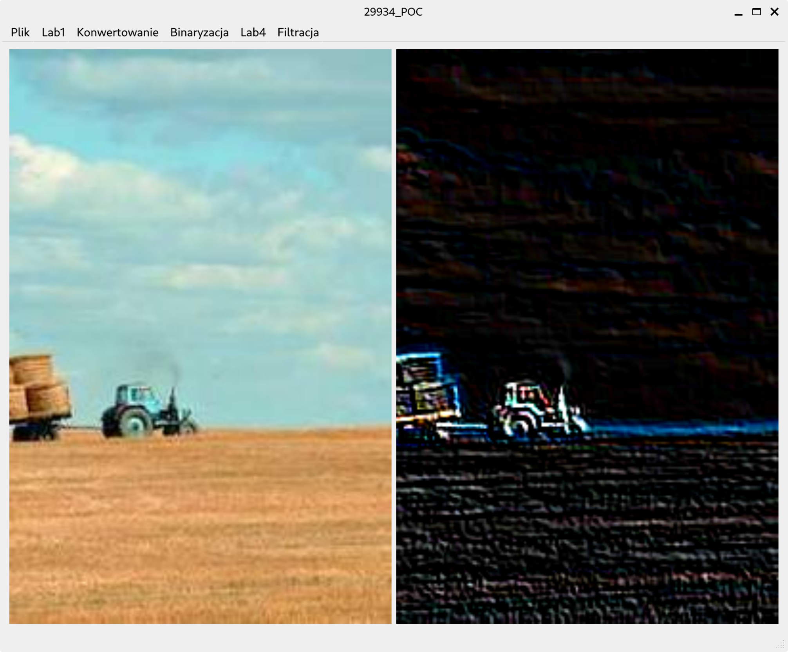
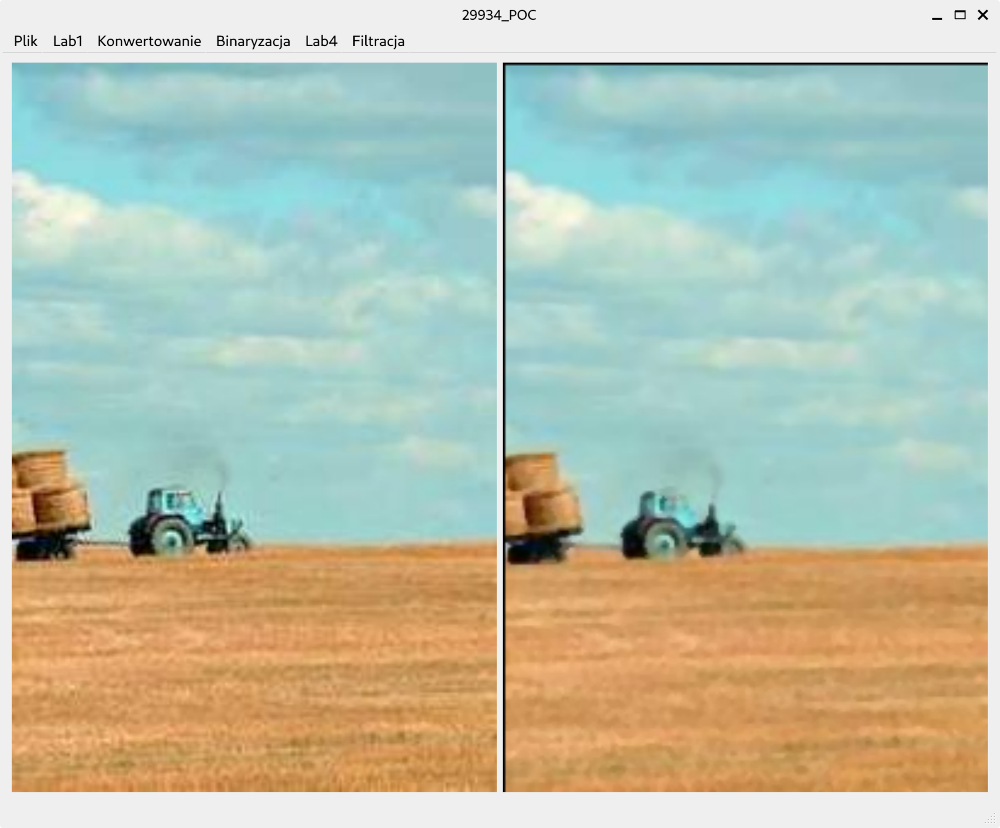

# POC (Przetwarzanie obrazów cyfrowych)

> Python desktop application with a set of functions for image manipulation using OpenCV

## 🚀 Technologies Used

- Python
- PyQt
- opencv

## 🖼️ Screenshots

